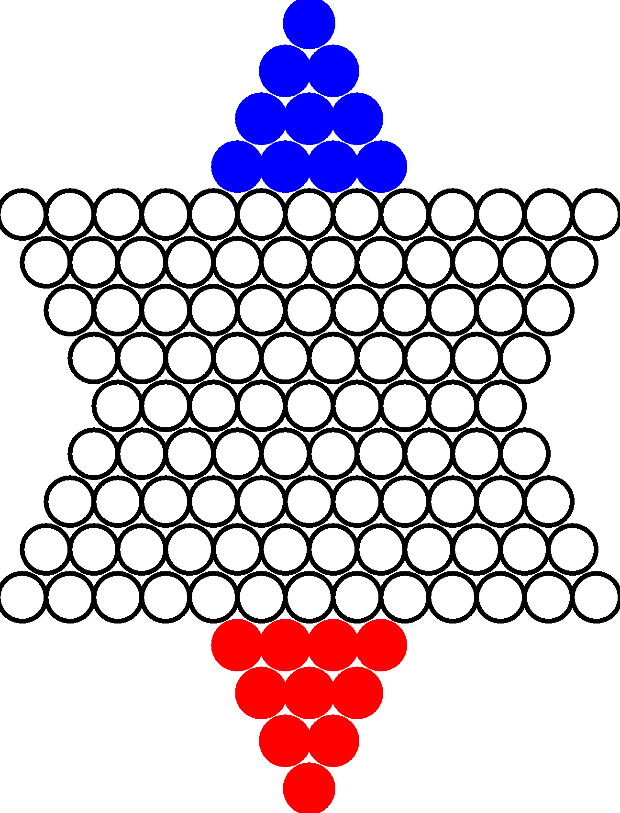

# Code for Chinese Checkers AI

  

## Author
Sravan Jayanthi

## Chinese Checkers AI
This is a Java program that is an Aritificial Intelligence player that utilizes machine learning and simulation methods to predict and execute moves in Chinese Checkers. This program allows for a user to play against the simulation iteration of the A.I.
It has both a graphical user interface.

### Chinese Checkers GUI
To run the program, open the GUI file from `ChineseCheckersMCTS\src\MCTSCCGame\GUI.java` in a Java IDE and run the interface to play the Chinese Checkers game.

### Code Example:  
Sample of simulating the potential outcomes of move.

	   public Node simulate(Seed seedSim, Node moveNode, int[] move) {
		   Seed[][] boardSimulation = copyBoard(gameBoard);
		   Seed currentPlayer = (seedSim == Seed.CROSS) ? Seed.NOUGHT : Seed.CROSS;
		   if (moveNode == null) {
			   moveNode = new Node(boardSimulation, currentPlayer, 0, 0, move[0], move[1], move[2], move[3], 0);
			   moveNode.createChildren(moveNode);
		   } else if (moveNode != null) {
			   moveNode = findChildren(moveNode, move[0], move[1], move[2], move[3]);
			   moveNode.createChildren(moveNode);
		   }
		   moveNode.setParent(null);
		   Node bestMove = runSim(boardSimulation, moveNode);
		   return bestMove;
	   }

## License
[GNU](LICENSE)
